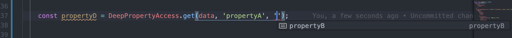

In this article, we are going to discover a few ways to access a deep object with optional properties. The scenario is if the property is undefined, we want to assign it a default value.

Let's say we have an object with an interface like this:

```typescript
interface IData {
    propertyA?: {
    propertyB?: {
        propertyC?: {
        propertyD?: string;
        };
    };
    };
}

const data: IData = {
    propertyA: {
    propertyB: {
        propertyC: {
        propertyD: 'deep property value',
        },
    },
    },
};
```

And we want to access `propertyD`:

```typescript
const propertyD = data.propertyA.propertyB.propertyC.propertyD || 'default value';
```

If the `tsconfig` has a `strictNullChecks` or `strict` set to true (which it should), the TypeScript compiler won't let us run the code.

In this case, we will need to validate the that the property exists:

```typescript
let propertyD = 'default value';
if (data && data.propertyA && data.propertyB && data.propertyC && data.properyD) {
    propertyD = data.propertyA.propertyB.propertyC.propertyD;
}
```

As you can see, that quickly becomes cubersome. Let's explore other choices.

## Lodash Get

```typescript
import get from 'lodash.get';

const propertyD: string = get(data, ['propertyA.propertyB.propertyC.propertyD'], 'default value');
```

The issue here is that there is no type inference and propertyD might not be a string at the end. So, using this method doesn't give much safety.

## TypeScript Optional Chaining

TypeScript 3.7, which has been released in November 2019, introduced [TypeScript Optional Chaning](https://www.typescriptlang.org/docs/handbook/release-notes/typescript-3-7.html#optional-chaining). This is exactly what we are try to solve here.

The syntax is:

```typescript
const propertyD = data?.propertyA?.propertyB?.propertyC?.propertyD || 'default value';
```

If the optional chain breaks, meaning some property is `null`, the expression will return `undefined`.

As you can see it looks very similar to what we had with pure JavaScript, but in this case the compiler will pass our code!

There is one caveat though, which I experienced myself. You need to have the VSCode with TypeScript 3.7. Otherwise, you will get a syntax error.

To check the version, press `Shift` + `⌘` + `P` and choose *Select TypeScript Version*. If the version is old, update VSCode or install the extension [JavaScript and TypeScript Nightly](https://marketplace.visualstudio.com/items?itemName=ms-vscode.vscode-typescript-next). 

As you can see that's a lot of work, which needs to be synced across your team. Therefore, there is another option.

## DeepPropertyAccess

The next candidate is a type-safe [Deep Property Access](https://codewithstyle.info/Deep-property-access-in-TypeScript/). Attributes to [miloszpiechocki](https://www.reddit.com/user/miloszpiechocki/), who implemented [the initial idea](https://codewithstyle.info/Deep-property-access-in-TypeScript/).

This is the second best implementation I found after TypeScript Optional Chaining because it comes with type-checking and intellisense support.

As such, I use it in all the projects.



### Usage

Copy-paste [this implementation](https://www.typescriptlang.org/play/?ts=3.3.3#code/C4TwDgpgBAcjA8AVAfFAvLA9gOxgVwBsCBDAIwIiWQG4AoWiADzEwCdgoBjEgZx6gAiECGAAKrTJHYgAgp04Q+UAN60oUNVDB5yAS05QewYsH1QA5hGBIANJvWiAjFCbAI2ACb8A1hBCYAM1gEFGQACkxSACsALihEGy0JMEc4pwBKOLgqAG0nAF0oAB8oPE8IAN1sCA86TQB6eqhgHgIq4BiPXR4yChiAW2JGAFo26tH3c2AAC01tPQMjEzNLawT7KCcXRjdPHz9A4Ko7dQcAJm3dryhffyDs7JQ8x3zkcMjY+MSwZNTNx2+yTOaTOmSOj2Qz1eeTOhRKZQ8FSqNTq6nmbUWxlMBlWtg2W1c7mut0OEJOp1EF0JexuB3uCAhUOQ5IcAGZLkT9ndwQyQpCCvzYW8ItE4gkkpI-k5AZJgZszjKwKy0qywQ9ebkBTDoaJWXDSuVKtVavQ0ToMYYsSsrHjTv8OTSSfTjviqTtObTuerNS9mfj2dTiXSefBGVrKa8WZsACwOoNejXep7hoV5PXCj5ixVSgESsByymK5WbVmK6NpaNqxMa5O+7X89N5aP6hFI42orTmsxLbEWG3rO0E92O4Nk11xrmkmv831R3UTz1T0PTpn1uexwOT53esN1iMNyP4gCsC6dIZ3fNX+7TOubGdFXzzOcVBYVeeLurLFcVR7SR6ry6AUmM46qmuq3jqR4toayImpocxdpiyw4v2c7OJui7Oigc5ulcW4hrWh6DgGw7xkuwFXkK66nqO1aAYRgo6umc4nhhZ4XkBl4pkxEF+oOABsNEJpxIm7qBPH8neeRQfenzij8kppLmCn5iCRYql+MY-n+ir8Wk-EARxFHcQekmQTq-HQYiRoog0ABUzStO0MTuL0EADEMozIhM2BTNMUB2fUppQI0UAAHQRcQniGJgUA4BFYXBaFMzQMQnDAHgxAEFAARlOlug4M0sWuKwaUcCleYQNICELJayF9sAIqfFFICJAlKk8HERisFU5g5PkYItSoGysFYeCsNgcXRFAABkM15jwYWjR4eAKGEGzqGEo08IQwCKuk6CoNtu3oBg2CENlAD8BrWbBUBxMdBDADkKn5FG6gfBs6R0OoAC+tD-VwOBGFAFAAG4QAQAD6gkYKodrqODkNQ7+w0I6cSPQ+WaPoxjEAQ9Dxbw7jdqY1DcrEyTpP48jfw5AA5AAEpDBCYPT+QbbjgNU9z6O86c-O-R2nDAxwj0cBgQgiOIkhVaAcgKHwYWrGEZP8Yk9Nk0e9Ma2T0Y61Ams04TBtGwT5Om2Tjj0999C0EAA) in your project, and use it like so:

```typescript
import { DeepPropertyAccess } from 'path-to-module';

const propertyD = DeepPropertyAccess.get(data, 'propertyA', 'propertyB', 'propertyC', 'propertyD') || 'My default value';
```

In this post, we had a problem of TypeScript compiler not allowing us to use nullable properties in the object. Therefore, we went on to explore different options. The built-in JavaScript solution was too lengthy while Lodash's get helper didn't provide type-safety. We ended up looking at TypeScript's new feature Optional Properties as well as Deep Property Access - [solution published by miloszpiechocki](https://codewithstyle.info/Deep-property-access-in-TypeScript/). Finally we went on with the latter option because TypeScript's Optional Chaining is not yet widely supported in people's IDEs.