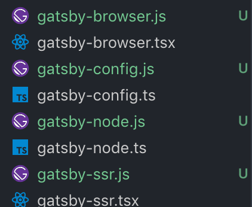
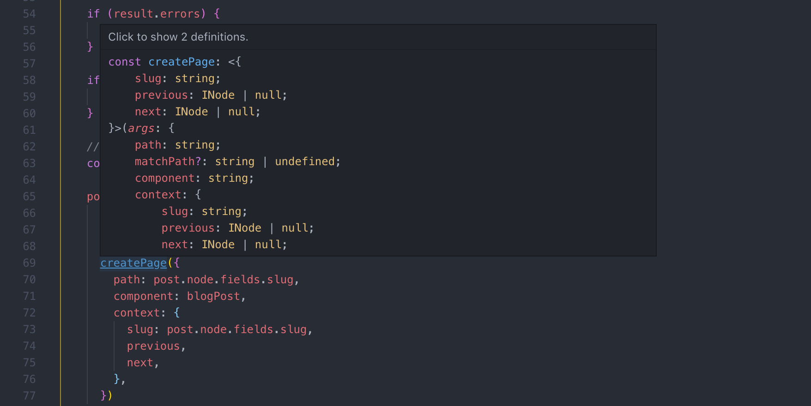

Welcome to the third part of the series [Migrating Gatsby to TypeScript!](https://www.extensive.one/migrating-gatsby-to-typescript-introduction/)

In the last part we saw how to setup a Gatsby project with TypeScript. In this part, we will examine multiple ways how to write `gatsby-config` and `gatsby-node` modules in TypeScript.

In my opinion, this is the most important part of the series. There are a lot of resources on setting up TypeScript, or usage of TypeScript with React, but not so much about type-checking Gatsby API itself. Sadly, most of the TypeScript boilerplates on Github don't convert Gatsby files into TypeScript - and this is something I want to change.

My first idea was to just use `gatsby-config.ts` and `gatsby-node.ts`, but then, with the help of a build error, I recalled these files aren't getting passed through the webpack like React components, and therefore not getting transpiled to JS:
<div class="filename">terminal</div>

```bash
    ERROR #10124  CONFIG
    It looks like you were trying to add the config file? Please rename "gatsby-config.ts" to "gatsby-config.js"
```
These Gatsby files are a part of the node process, and the process expects to find JavaScript. With that in mind, there are two solutions:

1. Compile them to JS with TypeScript compiler on the pre-build script.
2. Use `ts-node` compiler to support TypeScript module imports inside JS files.

Let's explore the options one by one.

### Compiling Gatsby files with pre-build script

The idea is to compile TS and emit JavaScript files right nearby.



 

Looks a bit messy, but you can obviously move your TS files into a `src` directory, and specify `rootDir` in compiler options as a root directory.

That being said, you don't want to emit every TS/TSX file in your project because that's taken care of by `gatsby-plugin-typescript` . For this purpose, you will need two tsconfigs: one for your React components transpiled by `gatsby-plugin-typescript`, and one for your gatsby files.

First `tsconfig.json` for the `gatsby-plugin-typescript`:
<div class="filename">tsconfig.json</div>

```json
{
    "compilerOptions": {
        "sourceMap": true,
        "noImplicitAny": true,
        "module": "commonjs",
        "strict": true,
        "noEmit": true, // you don't need to emit TS files on compile
        "target": "esnext",
        "jsx": "react",
        "allowJs": true,
        "lib": ["dom", "es2015", "es2017"],
        "noImplicitReturns": true,
        "esModuleInterop": true,
    },
    "exclude": ["./node_modules", "./public", "./.cache", "./gatsby-config.ts", "./gatsby-node.ts", "./gatsby-browser.ts", "./gatsby-ssr.ts"],
    "include": [
        "./src/**/*"
    ]
}
```
Second `tsconfig-gatsby.json` for the gatsby files compiler:
<div class="filename">tsconfig-gatsby.json</div>

```json
{
    "compilerOptions": {
                "outDir": "./",
        "noImplicitAny": true,
        "module": "commonjs",
        "strict": true,
        "noEmit": false,
        "jsx": "react",
        "target": "esnext",
        "noImplicitReturns": true,
        "esModuleInterop": true,
    },
    "exclude": ["./node_modules", "./public", "./.cache", "./src/**/*"],
    "include": [
        "./gatsby-config.ts",
        "./gatsby-node.ts",
        "./gatsby-browser.tsx",
        "./gatsby-ssr.tsx"
    ]
}
```

Pay attention to `outDir` and `noEmit` properties above as they are important.

Any the last thing to add is the pre-build script in our `package.json`:
<div class="filename">package.json</div>

```json
"scripts": {
    "build": "tsc -p ./tsconfig-gatsby.json && gatsby build",
    "develop": "tsc -p ./tsconfig-gatsby.json && gatsby develop",
        ...other scripts
}
```

Done! Now you can safely use TypeScript in your Gatsby files.

There are a few outcomes to point here:

- All gatsby files and all the modules being imported by them will be emitted as JS files and be stored alongside TS files.
- You should always remember to compile the files with a separate tsconfig in your `package.json` scripts.

This is a completely valid way to compile gatsby files, and I wouldn't be against it. However, I also want to show you another, a more hassle-free, way.

### Enable Gatsby JS files to import TypeScript files

The title says is it all: we will use existing Gatsby files, which will only import TypeScript files.

Remember the `ts-node` package we installed earlier? It's a handy tool that helps JavaScript files understand TypeScript imports. `register` method is used to register `ts-node` only once and be available in subsequent JS/TS modules. 

So, we only need to register it once somewhere up the stream like in `gatsby-config.js`, and it will enable us to import TypeScript modules subsequently. That means we can configure our gatsby-config only once, and abstract away all the good parts written in TypeScript.

Let's see the example `gatsby-config.js` file:
<div class="filename">gatsby-config.js</div>

```javascript
'use strict';

/**
* Source-map-support mimics node's stack trace making debugging easier
* ts-node register helps importing and compiling TypeScript modules into JS
*/
require('source-map-support').install();
require('ts-node').register();

module.exports = require('./gatsby-config.ts');
```

So, now we can create the TypeScript version of the config:
<div class="filename">gatsby-config.ts</div>

```typescript
import { config } from './content/website/config';

const { siteTitle, siteDescription, siteUrl, siteColors, siteIcons } = config;

export default {
    siteMetadata: {
    title: siteTitle,
    description: siteDescription,
    siteUrl,
    },
    plugins: [
    'gatsby-plugin-sass',
    `gatsby-plugin-typescript`,
    ...other plugins,
    ],
};
```

Now we can finally have 100% type-checked code. That's amazing!

For the gatsby-node, it's even easier - we just need to change the extension to TS and it will be imported down the stream by Gatsby. Let's take a look at our `gatsby-node.ts`:
<div class="filename">gatsby-node.ts</div>

```typescript

export { createPages } from './src/gatsby/create-pages';
export { addSlugToPage as onCreateNode } from './src/gatsby/add-slug-to-page';
```

We are importing and then immediately exporting createPages and onCreateNode modules needed by Gatsby. All the logic is stored elsewhere. Have you ever seen such a short Gatsby Node file? I haven't.

The same technics apply to `gatsby-browser.ts` and `gatsby-ssr.ts` .

### Type-Checking Gatsby Node

`gatsby-node` is perhaps the most important file in your project. It fetches loads of data from different sources, transforms it and passes to it pages. I've seen the file can easily span 200 lines of code with a single gatsby hook createPages. You have already seen how you can modularize the file, but how can you setup proper type-checking? Let's find out.

Have a look at create-pages module:
<div class="filename">create-pages.ts</div>

```typescript
import { GatsbyNode } from 'gatsby';
import * as path from 'path';

export interface INode {
    fields: {
        slug: string;
    };
    frontmatter: {
        title: string;
    };
}

interface IQueryResult {
    allMarkdownRemark: {
        edges: {
            node: INode;
        }[];
    };
}

/**
 * Gatsby exposes interfaces for every lifecycle hook
 */
export const createPages: GatsbyNode['createPages'] = async ({ graphql, actions }) => {
    const { createPage } = actions
    
        // Ensure the path now points to TSX template
    const blogPost = path.resolve(`./src/templates/blog-post.tsx`)

    /**
     * Pass the query structure generic for complete type-check coverage
     */
    const result = await graphql<IQueryResult>(
        `
        {
            allMarkdownRemark(
            sort: { fields: [frontmatter___date], order: DESC }
            limit: 1000
            ) {
            edges {
                node {
                fields {
                    slug
                }
                frontmatter {
                    title
                }
                }
            }
            }
        }
        `
    )
    
    if (result.errors) {
        throw result.errors
    }

    if (!result.data) {
        throw new Error('ERROR: Could not fetch posts on build');
    }
    
    // Create blog posts pages.
    const posts = result.data.allMarkdownRemark.edges
    
    posts.forEach((post, index) => {
        const previous = index === posts.length - 1 ? null : posts[index + 1].node
        const next = index === 0 ? null : posts[index - 1].node
    
        createPage({
        path: post.node.fields.slug,
        component: blogPost,
        context: {
            slug: post.node.fields.slug,
            previous,
            next,
        },
        })
    });
}
```

I haven't changed much in the create-page hook - just added interfaces and a generic input to `graphql` tag. But it already gave us full type-check coverage. Isn't that cool?



Hopefully the example above gave you a general idea. You can also check another hook [add-slug-to-page in the final repo](https://github.com/assainov/gatsby-extensive-starter-typescript/blob/master/src/gatsby/add-slug-to-page.ts).

In this part we saw two different ways of converting Gatsby API files into TypeScript. You're now able to write completely type-safe Gatsby logic. In the next part, we will discover how to efficiently convert Gatsby pages and components without adding too much boilerplate.

See you there!

...

By the way, this very blog is also written in TypeScript. I applied all the principles we saw in this post to elegantly convert the Gatsby API there as well. [Check it out!](https://github.com/assainov/extensive.one)