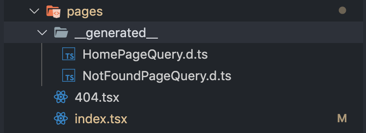

In the previous part, we successfully [converted Gatsby API modules to TypeScript](https://www.extensive.one/converting-gatsby-config-and-node-api-to-typescript/).

In the post, we will finally dive into migrating pages. This example is universal for any Gatsby page, template or a child component, so for the theory we will only focus on the home page.

As always, you can find the final repository in this starter: [gatsby-extensive-starter-typescript](https://github.com/assainov/gatsby-extensive-starter-typescript/).

First, let's start off by renaming the home page file from `index.js` to `index.tsx`. TSX extension is necessary if you're using TSX syntax, otherwise TypeScript will take XML brackets as a type cast and throw an error.
<div class="filename">index.tsx</div>

```typescript
...importing modules

import { IPageProps } from '../types/page-props';

class BlogIndex extends React.Component<IPageQuery & IPageProps> {
    render(): JSX.Element {
    const { data } = this.props;
    const siteTitle = data.site.siteMetadata.title;
    const posts = data.allMarkdownRemark.edges;

    return (
        <Layout location={this.props.location} title={siteTitle}>
        <SEO title="All posts" />
        <Bio />
        {posts.map(({ node }) => {
            const title = node.frontmatter.title || node.fields.slug;
            return (
            <article key={node.fields.slug}>
                <header>
                <h3
                    style={{
                    marginBottom: rhythm(1 / 4),
                    }}
                >
                    <Link style={{ boxShadow: `none` }} to={node.fields.slug}>
                    {title}
                    </Link>
                </h3>
                <small>{node.frontmatter.date}</small>
                </header>
                <section>
                <p
                    dangerouslySetInnerHTML={{
                    __html: node.frontmatter.description || node.excerpt,
                    }}
                />
                </section>
            </article>
            );
        })}
        </Layout>
    );
    }
}

export default BlogIndex;

interface IPageQuery {
    data: {
    site: {
        siteMetadata: {
        title: string;
        };
    };
    allMarkdownRemark: {
        edges: IEdge[];
    };
    };
}

interface IEdge {
    node: {
    excerpt: string;
    fields: {
        slug: string;
    };
    frontmatter: {
        date: string;
        title: string;
        description: string;
    };
    };
}

export const pageQuery = graphql`
    query {
    site {
        siteMetadata {
        title
        }
    }
    allMarkdownRemark(sort: { fields: [frontmatter___date], order: DESC }) {
        edges {
        node {
            excerpt
            fields {
            slug
            }
            frontmatter {
            date(formatString: "MMMM DD, YYYY")
            title
            description
            }
        }
        }
    }
    }
`;
```

As you can see at first, the page is a regular React class component, so there is nothing new here. Gatsby passes `location` prop to all generated pages. `IPageProps` is an interface with that location prop, which is passed to all pages by `@reach/router`. 
<div class="filename">page-props.ts</div>

```typescript
import { WindowLocation } from '@reach/router';

export interface IPageProps {
    location: WindowLocation;
}
```

`IQueryProps` is an interface for the graphql query. 

Maybe you already noticed: our interface has the exact same structure as the graphql query. Woudn't it be nice if we could take advantage of that? We will come back later to this point.

For now let's fix one important issue.

### Validating GraphQL query result with TypeScript
I left a mistake on purpose in the code snippet above: graphql result interface does not have any optional (nullable) types, but what happens if the data from the query is not available? Because the data might be coming from CMS, you shouldn't rely on it - you need to always validate it. This is where the whole power of TypeScript comes in!

What happens if the data from the query is not available? Because the data might be coming from CMS, you shouldn't rely on it - you need to always validate it.

First, you need to make sure you setup TypeScript compiler to enable `strict` or `strictNullChecks` modes (strict mode already includes strictNullChecks). Once you enable it, specify all props in the query as optional:
<div class="filename">index.tsx</div>

```typescript
interface IPageQuery {
    data: {
    site?: {
        siteMetadata?: {
        title?: string;
        };
    };
    allMarkdownRemark?: {
        edges?: IEdge[];
    };
    };
}

interface IEdge {
    node?: {
    excerpt?: string;
    fields?: {
        slug?: string;
    };
    frontmatter?: {
        date?: string;
        title?: string;
        description?: string;
    };
    };
}
```

Now the compiler will always complain until you provide a default value to the prop. The reason is the compiler wants to ensure we don't get a runtime error in case any of the properties is null:
<div class="filename">terminal</div>

```bash
TypeError: Cannot read property 'title' of undefined
```

So, let's provide a default value in case our prop is empty:
<div class="filename">index.tsx</div>

```typescript
...
// other imports
import { DeepPropertyAccess } from '../utils/deep-property-access';
...
// inside render() method
const siteTitle = DeepPropertyAccess.get(data, 'site', 'siteMetadata', 'title') || 'My site';
...
```

You can now safely use `siteTitle` in your React component without having to worry about runtime errors. The `DeepPropertyAccess.get()` method provides type inference and intellisense support for the object `data`. To learn more about different ways to accomplish the same, check out this 5-min read: [Accessing Deep Properties in TypeScript](https://www.extensive.one/accessing-deep-properties-in-typescript).

## Reducing typescript boilerplate code
Now that our code is compiling, we can look into the problem with reduntant interfaces for graphql query result. Remember? When we define an interface for a graphql query result, we write something like this...
<div class="filename">index.tsx</div>

```typescript
interface IPageQuery {
    data: {
    site?: {
        siteMetadata?: {
        title?: string;
        };
    };
    };
}
```

... For our query that looks like:
<div class="filename">index.tsx</div>

```graphql
query HomePageQuery {
    site {
        siteMetadata {
        title
        }
    }
}
```
    

Can you see it? It's the exact same structure.

Luckily, as always, there is a handy plugin to generate interfaces on the fly: `gatsby-plugin-codegen`. Let's install it and see how it works:
<div class="filename">terminal</div>

```bash
npm i -D gatsby-plugin-codegen
```

Include it in `gatsby-config.ts`:
<div class="filename">gatsby-config.ts</div>

```typescript
plugins: [
    // other plugins
    {
        resolve: 'gatsby-plugin-codegen',
        options: {},
    },
],
```

Start the development server:

<div class="filename">gatsby-config.ts</div>

```bash
npm start
```

And observe the magic:



The plugin has automatically generated interfaces for all graphql queries, and put them in the same directory as a component in the __generated__ folder:

In HomePageQuery.d.ts:
<div class="filename">HomePageQuery.d.ts</div>

```typescript
export interface HomePageQuery_site_siteMetadata {
    __typename: "SiteSiteMetadata";
    title: string | null;
}

export interface HomePageQuery_site {
    __typename: "Site";
    siteMetadata: HomePageQuery_site_siteMetadata | null;
}

// other interfaces
```

And that's all to it. Simple, yet powerful!

The plugin will also generate `schema.json` and `apollo.config.js` configuration files in the root of the project. You can learn more and tweak many plugin options available on the [plugin's page](https://www.gatsbyjs.org/packages/gatsby-plugin-codegen/).

Now that we automatically generate graphql response interfaces, all we need to do is import the interface into the page:
<div class="filename">index.tsx</div>

```typescript
import { HomePageQuery } from './__generated__/HomePageQuery';

interface IPageQuery {
    data: HomePageQuery;
}

class BlogIndex extends React.Component<IPageQuery & IPageProps> {
// body
```

In this tutorial, we mainly learned two things: 

1. All graphql props should be validated with the help of deep property access helper.
2. Graphql response interface generation can be automated with the help of the plugin.

Although the process was simple, we as developers can now be more productive and sleep better.

I hope you liked the article. In the next part, we will dive deeper into building robust Gatsby apps by introducing unit and end-to-end tests. As always, the focus will be on the developer productivity and quality. 

Stay in touch!
