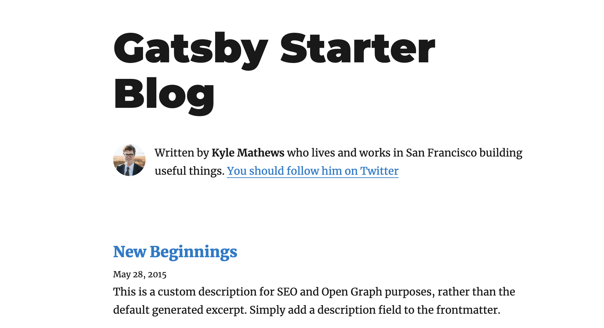
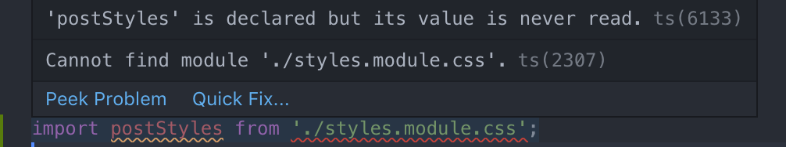
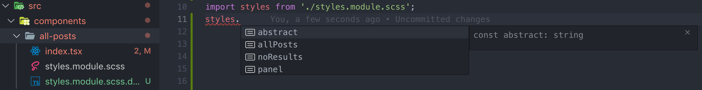

This is the first part of the series: [Migrating Gatsby to TypeScript](https://www.extensive.one/migrating-gatsby-to-typescript-introduction). 

In this post, we will setup the project with ESLint + Prettier, TypeScript, type definitions, SASS and other good stuff.

The best way to follow the article is to clone the [gatsby-starter-blog](https://github.com/gatsbyjs/gatsby-starter-blog) and follow along with code samples. All the examples are included in the boilerplate [gatsby-extensive-typescript-starter](https://github.com/assainov/gatsby-extensive-starter-typescript), which you can use to bootstrap your Gatsby + TypeScript project.

## Starter
<div class="filename">terminal</div>

```bash
git clone https://github.com/gatsbyjs/gatsby-starter-blog.git && cd gatsby-starter-blog
```

Run the project and ensure everything is working as expected.
<div class="filename">terminal</div>

```bash
npm i && npm start
```
Open the [http://localhost:8000/](http://localhost:8000/) and ensure you see the right project.



## ESLint + Prettier

Let's start off with linting. ESLint is a great tool to keep the code standards in your project, and it should be the first step to achieving code quality and developer productivity.

There is a ton of linting configurations out there. In this tutorial, I want to give you some starting point, and if it doesn't fit your needs, you can easily **extend** it.

For everything to work, first install the [ESLint extension](https://marketplace.visualstudio.com/items?itemName=dbaeumer.vscode-eslint) if you're using VSCode.

Next, install the dev dependencies:
<div class="filename">terminal</div>

```bash
npm i -D eslint @typescript-eslint/parser @typescript-eslint/eslint-plugin prettier eslint-config-prettier eslint-plugin-prettier typescript
```

You might be more inclined to using TSLint with TypeScript, but the fact is TSLint maintainers will soon [deprecate](https://medium.com/palantir/tslint-in-2019-1a144c2317a9) it in favor of ESLint. The reason is to align with TypeScript team, who gradually wants to enrich JavaScript language itself, and not the wrappers around it. This is the good news since there will be one less decision we need to make.

Create a file `.eslintrc.js` in the root and paste the following:
<div class="filename">.eslintrc.js</div>

```javascript
module.exports = {
    parser: "@typescript-eslint/parser", // Specifies the ESLint parser
    extends: [
        "plugin:react/recommended", // Uses the recommended rules from @eslint-plugin-react
        "plugin:@typescript-eslint/recommended", // Uses the recommended rules from @typescript-eslint/eslint-plugin
        "prettier/@typescript-eslint", // Uses eslint-config-prettier to disable ESLint rules from @typescript-eslint/eslint-plugin that would conflict with prettier
        "plugin:prettier/recommended" // Enables eslint-plugin-prettier and eslint-config-prettier. This will display prettier errors as ESLint errors. Make sure this is always the last configuration in the extends array.
    ],
    parserOptions: {
        ecmaVersion: 2018, // Allows for the parsing of modern ECMAScript features
        sourceType: "module", // Allows for the use of imports
        ecmaFeatures: {
            jsx: true // Allows for the parsing of JSX
        }
    },
    rules: {
        // Place to specify ESLint rules.
        '@typescript-eslint/interface-name-prefix': ['error', { prefixWithI: 'always' }],
        'react/prop-types': 'off',
        '@typescript-eslint/ban-ts-ignore': 'off'
    },
    settings: {
        react: {
            version: "detect" // Tells eslint-plugin-react to automatically detect the version of React to use
        }
    }
};
```

I used JS file instead of JSON to make it easier to leave comments for you and my future self. I use this configuration in all my personal projects. You should experiment with the file for your DX (development experience).

Eslint alone, won't prettify our code, so let's help it with `.prettierrc.js`:
<div class="filename">.prettierrc.js</div>

```javascript
module.exports = {
    semi: true,
    trailingComma: "all",
    singleQuote: true,
    printWidth: 120,
    tabWidth: 2
};
```

I also have `.prettierignore` for obvious reasons:
<div class="filename">.prettierignore</div>

```plaintext
.cache
package.json
package-lock.json
public
```

And finally configure your project to have independent  ~/.vscode/`settings.json` (in case you're using VSCode):
<div class="filename">settings.json</div>

```json
{
    "[json]": {
        "editor.formatOnSave": true // Let Prettier format JSON files
    },
        "eslint.autoFixOnSave": true,
    "eslint.validate": [
        "javascript",
        "javascriptreact",
        { "language": "typescript", "autoFix": true },
        { "language": "typescriptreact", "autoFix": true }
    ]
}
```

The config above will turn on prettier formatting on save while fixing all ESLint errors automatically for you.

If you want to learn a bit more in-depth about Prettier and ESLint, check out this [link](https://www.robertcooper.me/using-eslint-and-prettier-in-a-typescript-project).

If you've set up everything correctly, but eslint and prettier aren't working, make sure you install the ESLint extension and [TypeScript](https://www.npmjs.com/package/typescript) dependency.

## TypeScript Integration

Next up is the TypeScript configuration. This section isn't small, but it will shed some light on specificity of TypeScript working with Gatsby / React.

TypeScript dependecies, which will be used:
<div class="filename">terminal</div>

```bash
npm i -D gatsby-plugin-typescript typescript ts-node source-map-support @types/react @types/react-dom @types/node @types/react-helmet @types/typography
```
I don't want to touch `ts-node` and `source-map-support` just yet - we will cover them later on.

For now just configure `gatsby-plugin-typescript` like so in the `gatsby-config.js`:
<div class="filename">gatsby-config.js</div>

```typescript
plugins: [
    `gatsby-plugin-typescript`,
    ],
```

What I want to explain is how TypeScript integrates with Gatsby, and specifically with React. Gatsby is bundled with Webpack under the hood. If you have worked with React and TypeScript, you might know that [@babel/plugin-transform-typescript](https://babeljs.io/docs/en/babel-plugin-transform-typescript) is a handy babel plugin that transpiles TypeScript files into plain JavaScript. It also adds TypeScript syntax support to your code. Amazing, right?

Not yet. Actually the plugin alone does not do any type-checking for your code - it only transpiles it to JS, and even with some [caveats](https://gatsby.dev/unit-testing\). That means if you have any serious TypeScript errors, you will never find them. So, you need to find a way to type-check the code yourself.

How do you do it? That's where `typescript` library comes into play. Once you setup your preferred compiler options by running `tsc --init` and configuring `tsconfig.json` , you can just add and run any of the commands in `package.json`:
<div class="filename">package.json</div>

```json
"scripts": {
    "type-check": "tsc --noEmit",
    "type-check:watch": "npm run type-check -- --watch",
    }
```

You can run the command on the Gatsby pre-build stage with the help of the scripts to catch type errors early on. The compiler will have it's own type *investigation* and show you what is wrong.

I know what you're thinking. When I first saw it, to me it was lame to use two different tools to do one job. 

Thankfully, nowadays most of the IDEs support the TypeScript syntax and immediate type-checking. For example, VSCode and WebStorm both have a native support while Atom has a plugin.

To summarize this section, all you need for the typescript setup for your React components is to:

1. Add the gatsby-plugin-typescript
2. Use an IDE with TypeScript support
3. Occasionally type-check your code with `npm run type-check`

Moving on.

## CSS/SCSS Integration

If you're using CSS, CSS modules or Sass in your projects, then this section is for you. 

By default, Gatsby supports importing these filetypes in components by using `style-loader` , `css-loader` and `sass-loader` provided you install latter one. However, our TypeScript will still complain because it can't find type definitions for the file.



As always with Gatsby, there is a rich plugin ecosystem, and I found a plugin that was *promising at first*- `gatsby-plugin-scss-typescript`:

<div class="filename">gatsby-config.js</div>

```typescript
    plugins: [
    		'gatsby-plugin-scss-typescript'
    ]
```
At first I thought this is gold - the plugin generates typings for you and provides intellisense for all the classnames!



But then I realized - the typings are generated only during the build. So, if you're actively developing, you will need to re-run the build every time you add a stylesheet. 

Isn't that what we are try to avoid in the first place?

So, the solution is to go with another idea: we will create our own module declaration that targets all files ending with `css`/`scss` . Include it in ~/src/typings/ `declarations.d.ts`:
<div class="filename">declarations.d.ts</div>

```typescript
declare module '*css' {
    const content: { [className: string]: string };
    export default content;
}
```

In case you're using SASS, don't forget to install the dependency and include it in `gatsby-config.js`:
<div class="filename">terminal</div>

```bash
npm i gatsby-plugin-sass
```
<div class="filename">gatsby-config.js</div>

```javascript
plugins: [
    'gatsby-plugin-sass',
        ...other plugins
]
```

By following this approach, we lost autocomplete, but we're now able to add stylesheets on the fly and avoid TS compiler complaining about unknown module imports. The ideal TypeScript solution is yet to be found.

Let's recall what we have achieved in this tutorial. In order to maintain consistency across the project, we enabled ESLint (and Prettier) with the TypeScript-specific parser. Then we went on to add Gatsby plugin to compile React files. In the end we added support for CSS/SASS imports for TypeScript compiler.

What we haven't setup is the TypeScript coverage for Gatsby API files such as `gatsby-config.js` and `gatsby-node.js` because these files aren't transpiled through the webpack like the React components. The good news is we are going to cover that in the next part. Stay tuned!